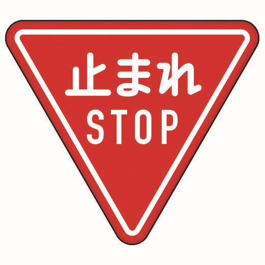

# 命令形　（初级第 29 课）

动词的命令形是表示绝对的命令。

(1) 用于上级对下级，长辈对晚辈以强硬的语气下命令。

(2) 用于亲密的男性朋友之间，表达邀请和劝诱。

(3) 用于试卷标题、引用句或交通标志等。

<sentences>
  
早く<b>寝ろ</b>！

  
自分の仕事は　自分で <b>しろ</b>！

  
早く<b>行け</b>！

  
その本を　貸して<b>くれ</b>！

</sentences>

  

# 动词なさい【命令】

 
<highlighted-block :dense="false">接续：动词<del>ます</del>形＋なさい</highlighted-block>

译为：“请（做）……”。多用于老师对学生，父母对孩子，年长对年轻的，上级对下级提出要求。

<sentences>
  
李さんにく<b>謝りなさい</b>。

  
早く学校に<b>行きなさい</b>。

  
レポートを<b>出しなさい</b>。

</sentences>

注意：生硬程度（不客气程度）：命令形 ＞　～なさい　＞　～てください

  

# 动词て・动词ないで

该句型只是省略了ください，使得语气稍显委婉。一般只用于关系亲密的人。

ドア開けて<del>ください</del>　 ➡️ 　ドア開けて

タバコを吸わないで<del>ください</del>　 ➡️ 　タバコを吸わないで

<sentences>
  
早く<b>帰って</b>ね。

  
ちゃんと朝ご飯を<b>食べて</b>ね。

  
ここにいて、どこへも<b>行かないで</b>。

  
<b>遠慮しないで</b>、食べてね。

</sentences>

  

# 动词基本形な【禁止】

<highlighted-block :dense="false">接续：动词基本形　＋　な</highlighted-block>

译为：“禁止（做）……”， “不许（做）……”。

<sentences>
  
タバコを吸うな。➞ 　绝对禁止

  
喧嘩するな

  
諦めるな！頑張れ！

</sentences>
